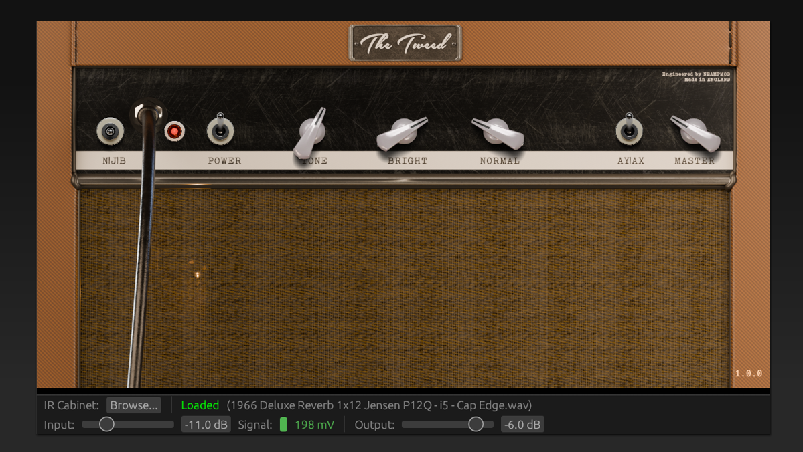

# NEAMPMOD The Tweed

The Tweed is a circuit-level simulation inspired by the 1957 Fender® 5E3 Deluxe amplifier.

The signal chain follows the real amp: dual-triode preamp (V1A/V1B) into a 68kΩ mixing network, 
through the tone circuit, into a 12AX7 gain stage (V2A), cathodyne phase inverter, and push-pull 
6V6 power section with an output transformer. A cabinet impulse response is applied at the output,

I've tried to capture the 5E3's "interesting" channel interaction - the tone, and two volume
channels interact via an MNA network. Unlike the real 5e3 the interaction on the volume channels
is inverted (not by design...), so if you drive the Bright channel in Bright channel mode then
turn down the Normal channel it will attenuate the signal, and so it goes for the inverse.

The bright channel includes a 500pF treble bypass capacitor.

Power supply modelling includes a 5Y3 rectifier with current-dependent sag, 120Hz ripple injection,
and a three-tap filter chain (B+1/B+2/B+3) with dropping resistors between stages. Screen grid sag 
is tracked independently per power tube.

    

## Using the Plugin

The Tweed is available in VST3 and CLAP plugin formats for Linux and Windows.

To install the plugins copy the `.vst3` to your VST3 directory, and likewise to your `.clap` directory for
the CLAP plugin.

The plugin includes a `default.wav` IR file, I strongly suggest loading a higher quality IR file to get
the best out of the plugin; The following sources provide excellent impulse response files:

* [Origin Effects IR Cab Library](https://origineffects.com/product/ir-cab-library/)
* [Tone3000](https://tone3000.com/)

### Tone3000 IR Files

I would suggest searching for Fender IRs on [Tone3000](https://tone3000.com/), there are a range of high-quality IRs with multiple microphones,
and microphone positions.

## Gain Setup

The `Signal` level meter displays the signal voltage as the simulated amplifier's input jack would see it. 

Use this to calibrate your signal chain to the physically correct operating range for the 1957 Fender® 5E3 Deluxe amplifier.

Expected voltage ranges by pickup type:

* Passive single-coils: 80 - 150mV moderate playing, 200–350mV hard attack
* Passive humbuckers: 150 - 350mV moderate playing, 400–700mV hard attack
* Active pickups: 500mV - 1.5V

### Calibration workflow

* Set your interface gain so hard playing peaks are comfortable and well below the clip LED — around -12 to -18 dBFS in your DAW if visible
* Play normally across your full dynamic range
* Use the input trim to bring the meter into the expected range for your pickup type
  * If the signal sits consistently above the expected range, reduce trim — you are driving the first tube stage harder than the real circuit would be driven
  * If it sits below, increase trim or add interface gain

Where the signal lands on the meter determines where `V1A` operates on its transfer curve — too high and the amp
will behave as if a boost pedal is already in the chain; too low and you will lose the touch sensitivity that emerges 
near the operating point.

## Reporting Issues

Please raise a GitHub issue with the following:

* Hardware and OS information
* Digital Audio Workstation (DAW) and version
* Description of issue
* Description of how to reproduce the issue

## Links to Useful Information

A great deal of information is avilable online regarding amplifier building, physics and designs, some of the links have provided invaluable information and insight:

* [ampbooks](https://www.ampbooks.com/)
* [robrobinette](https://robrobinette.com/)
* [helmutkelleraudio](https://www.helmutkelleraudio.de/)
* [diyaudio](https://www.diyaudio.com/)

## Author

* Daniel Wray

## License and Legal Information

This code is released under the [GNU GPLv3 license](LICENSE).

The binaries (VST3, CLAP) arereleased under a [Freeware EULA license](BINARY_LICENSE).

* Fender® is a registrated trademark of Fender Musical Instruments Corporation.
* VST® is a registered trademark of Steinberg Media Technologies GmbH.

