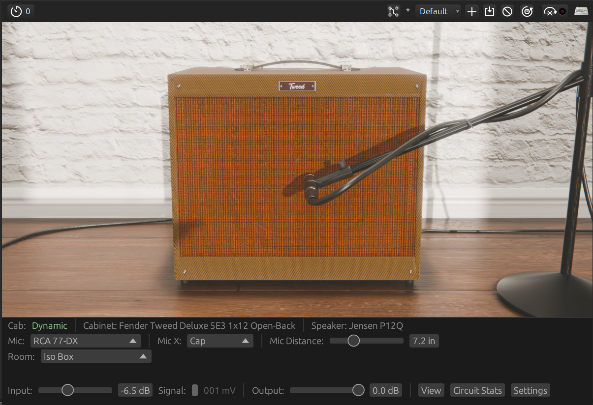
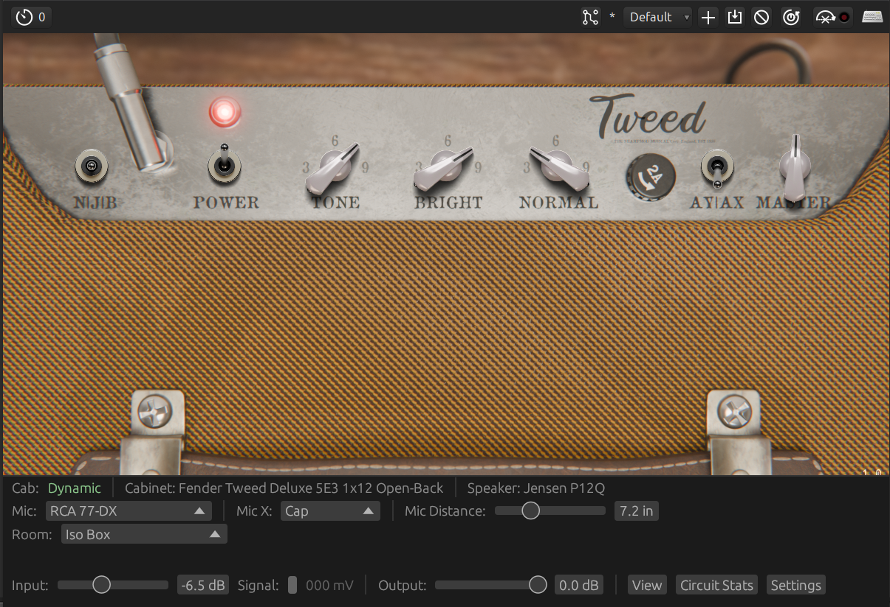

# NEAMPMOD The Tweed

The Tweed is a circuit-level simulation inspired by the 1957 Fender® 5E3 Deluxe amplifier.

* The `stock` v1a/b preamp tube is a General Electric 12AY7 100k (spline)
* The `mod` v1a/b preamp tube is a RCA 12AX7 100k (spline)
* The v2a voltage gain tube is a RCA 12AX7 tube 100k (spline)
* The phaser inverter stage uses a General Electric 12AX7 56k tube (spline)
* The v3/v4 power amp stage uses a RCA 6V6GT tube + 5e3 configuration (spline)
* The v5 rectifier stage uses a Generic 5Y3 (Koren)
  * Koren fitting based off of General Electric 5Y3 documentation
* Speaker impedence modelling assumes a Jensen® P12R speaker.
  * The plugin no longer ships with a default IR file, please see `Using the Plugin` section.

    

    

## Sample Rate & Oversampling

The amp DSP graph runs at `host sample rate × OS factor`, with ADAA1 applied at the tube non-linearities. The OS factor is selectable from the `Settings` modal - 1× (none) / 2× / 4× / 8× - and persists with the session. Default is 2×.

|OS Factor    |Effective Sample Rate (host 48 kHz) |Effective Aliasing Suppression Rate |
|-------------|------------------------------------|------------------------------------|
|1× (none)    |48 kHz                              |96 kHz                              |
|2× (default) |96 kHz                              |192 kHz                             |
|4×           |192 kHz                             |384 kHz                             |
|8×           |384 kHz                             |768 kHz                             |

Guidance:

* **1×** - minimum CPU, this works well for clean / edge of break up tones, and should work well on older hardware.
* **2×** - Lower CPU, decent balance of antialiasing, this is the default setting.
* **4×** - Use this if you have a powerful modern CPU, I have tested on a Ryzen AI Max 395 and this setting uses around 20 - 30% of a single core.
* **8×** - I'd recommend using this level of oversampling for mixdowns / non-live audio rendering.

### Applying an oversampling change

**The plugin must be reloaded for an oversampling change to take effect.** The audio thread holds a fully-monomorphised DSP graph per OS factor and cannot swap between factors without rebuilding state from scratch.

To apply a change:

1. Open the `Settings` modal and pick a new factor. The modal displays `Current: <active>` and `Selected: <pending>` whenever the two differ.
2. Reload the plugin instance. Any of the following works:
   * Remove and re-add the plugin in your track's FX chain.
   * Disable then re-enable the plugin slot.
   * Close and reopen the project.

The `Selected:` and `Will apply on next plugin reload` hints in the modal disappear once the audio thread picks up the new factor.

## Controls

|Control                |Parameters       |Description                                                                                                                                                              |
|-----------------------|-----------------|-------------------------------------------------------------------------------------------------------------------------------------------------------------------------|
|Channel Toggle         |`N`, `J`, `B`    |Toggles between two available channels, or jumpers channels. Volume controls are always active and interactive even if not jumpered, and/ or the channel is not active. |
|Power Toggle           |`On`, `Off`      |Turns the amp DSP `on`/ `off` - Note the plugin does not passthru signal when `off`. |
|Tone                   |1-12             |Controls the tone; This has a large impact on drive. |
|Bright Channel Volume  |1-12             |Drives `v1b` and has `500 pF` bright cap; Channel has more drive and treble than `Normal` channel. |
|Normal Channel Volume  |1-12             |Drives `v1a` and is warmer/ thicker than the `Bright` channel. |
|AY/AX Toggle           |`AY`, `AX`       |Swaps V1A and V1B between a `12AY7` (stock) and `12AX7` (higher-mu mod). The `12AX7` gives earlier, more aggressive breakup and a stiffer bright-cap HF lift. Triggers a control-rate rebuild of the V2A grid network. |
|Master Knob            |1-12             |Linear fine-tuning volume control at end of circuit after IR, this does not impact gain / tone. |

### IR Load (Browse Button)

Opens an OS-native file window, navigate to your IR WAV file and load it.

From version 2.0.0 onwards the plugin ships with **no** default IR - the signal path runs as a unity passthrough until you load one. The status strip reads "No IR Loaded" in this state. See below for suggestions on free IRs.

WAV files at any sample rate (44.1/48/88.2/96/176.4/192 kHz) are supported; the plugin resamples to the host rate on load using a high-quality polyphase FFT resampler. Loading is off the audio thread and swaps in with a short equal-power crossfade so there are no clicks when you switch cabs during playback.

### Input / Output Trim

Two sliders at the bottom of the plugin window:

* **Input Trim** - `−18 dB` to `+12 dB`, `0.1 dB` step. Applied to the DAW signal before the amp's input calibration / jack model. Use it to bring the `Signal` meter into the expected range for your pickup type (see `Gain Setup`).
* **Output Trim** - `−24 dB` to `0 dB`, `0.1 dB` step. Post-IR, pre-master. Use it to bring the plugin's output to a workable mix level without changing amp gain structure.

Both trims are smoothed over ~5 ms so automation does not click.

### Signal Meter (zones)

The colour next to the `Signal:` label reflects the live peak voltage at the simulated input jack:

* Gray - below 10 mV. No signal / instrument muted.
* Green - 10 mV to 800 mV. Typical guitar range (single coils through hotter humbuckers).
* Yellow - 800 mV to 1.5 V. Hot - active pickups, boost pedals upstream.
* Red - above 1.5 V. Clipping the input calibration; the first tube stage will be driven harder than the real circuit ever sees.

### View

Switches between viewing the front of the amplifiers and the amplifiers top control panel.

### Circuit Stats

Shows the simulated voltage levels within the amp, the `V1`, `V2`, and `v3/v4` are the B+ plate voltages.

### Settings

The `Settings` button at the bottom-right of the window opens a modal with the oversampling factor selector. See `Sample Rate & Oversampling` above for guidance and reload semantics.

## Using the Plugin

The Tweed is available in VST3 and CLAP plugin formats for Linux and Windows.

To install the plugins copy the `.vst3` to your VST3 directory, and likewise to your `.clap` directory for
the CLAP plugin.

The plugin does not ship with a default IR file - you must load your own. The following sources provide excellent impulse response files:

* [Origin Effects IR Cab Library](https://origineffects.com/product/ir-cab-library/)
* [Tone3000](https://tone3000.com/)

### Tone3000 IR Files

I would suggest searching for Fender / Jensen IRs on [Tone3000](https://tone3000.com/), there are a range of high-quality IRs with multiple microphones, and microphone positions.

## Gain Setup

The `Signal` level meter displays the signal voltage as the simulated amplifier's input jack would see it. 

Use this to calibrate your signal chain to the physically correct operating range.

Expected voltage ranges by pickup type:

* Passive single-coils: 80 - 150mV moderate playing, 200–350mV hard attack
* Passive humbuckers: 150 - 350mV moderate playing, 400–700mV hard attack
* Active pickups: 500mV - 1.5V

### Calibration workflow

* Set your interface gain so hard playing peaks are comfortable and well below the clip LED - around -12 to -18 dBFS in your DAW if visible
* Play normally across your full dynamic range
* Use the input trim to bring the meter into the expected range for your pickup type
  * If the signal sits consistently above the expected range, reduce trim - you are driving the first tube stage harder than the real circuit would be driven
  * If it sits below, increase trim or add interface gain

Where the signal lands on the meter determines where `V1A` operates on its transfer curve - too high and the amp
will behave as if a boost pedal is already in the chain; too low and you will lose the touch sensitivity that emerges 
near the operating point.

## System Requirements

The plugin targets `x86-64-v3` and newer CPUs, this should be anything after Intel Haswell or AMD Zen CPUs i.e. any CPU after 2013!

### Artifact Architecture Targets

|Artifact name                                     |Target CPUs                                           |
|--------------------------------------------------|------------------------------------------------------|
|`neampmod-the-tweed-linux-vMajor.mninor.patch-v3` |Haswell, Broadwell, Zen, Zen+, Zen 2, Zen 3, and newer|

### Running on Older Systems

If you are running an older machine please raise a GitHub Issue and I will add additional artifacts without optimisations.

## Reporting Issues

Please raise a GitHub issue with the following:

* Hardware and OS information
* Digital Audio Workstation (DAW) and version
* Description of issue
* Description of how to reproduce the issue

## Links to Useful Information

A great deal of information is avilable online regarding amplifier building, physics and designs, some of the links have provided invaluable information and insight:

* [ampbooks](https://www.ampbooks.com/)
* [robrobinette](https://robrobinette.com/)
* [helmutkelleraudio](https://www.helmutkelleraudio.de/)
* [diyaudio](https://www.diyaudio.com/)

## Author

* Daniel Wray

## License and Legal Information

This code is released under the [GNU GPLv3 license](LICENSE).

The binaries (VST3, CLAP) are released under a [GNU GPLv3 license](LICENSE).

* Fender® is a registrated trademark of Fender Musical Instruments Corporation.
* VST® is a registered trademark of Steinberg Media Technologies GmbH.

